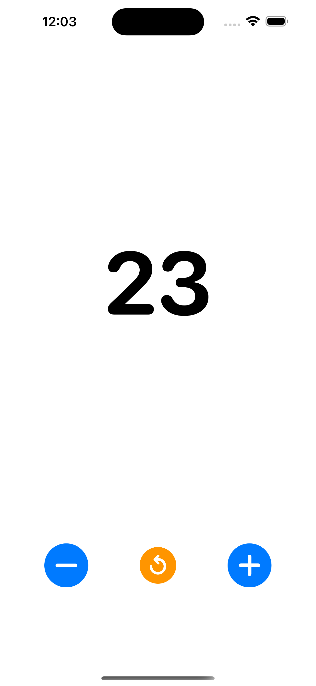

# Counter

A simple iOS counter demo app that uses volume buttons for hands-free counting, built using [GitHub Spec Kit](https://github.com/github/spec-kit), a specification-driven development toolkit.



## Features

- **Volume button counting**: Press volume up to increment, volume down to decrement
- **On-screen controls**: Fallback +/- buttons and Reset button
- **Persistence**: Counter value survives app restarts
- **Accessibility**: VoiceOver support

## Requirements

- iOS 15.0+
- Xcode 15.0+
- Physical iOS device (volume buttons don't work in simulator)

## Development Setup

1. Clone the repository
2. Copy the xcconfig template:

   ```bash
   cp Counter/Counter/Config/Local.xcconfig.template Counter/Counter/Config/Local.xcconfig
   ```

3. Edit `Counter/Counter/Config/Local.xcconfig` and replace `YOUR_TEAM_ID_HERE` with your Apple Development Team ID
4. Open `Counter/Counter.xcodeproj` in Xcode
5. Build and run on a physical device

### Finding Your Team ID

Your Apple Development Team ID can be found in:

- Xcode: Preferences → Accounts → Select your account → View Details
- Apple Developer Portal: Membership details page

## Building

```bash
# Build for device
xcodebuild -scheme Counter -destination 'generic/platform=iOS' build

# Build for simulator (UI only - volume buttons won't work)
xcodebuild -scheme Counter -destination 'platform=iOS Simulator,name=iPhone 15' build
```

## Project Structure

```text
Counter/Counter/
├── CounterApp.swift      # App entry point, lifecycle management
├── ContentView.swift     # Main UI view
├── Models/
│   ├── CounterState.swift    # State with auto-persistence (UserDefaults)
│   └── VolumeEvent.swift     # Volume button event model
├── Services/
│   └── VolumeListener.swift  # Volume button interception via AVFoundation
├── Contracts/
│   └── Interfaces.swift      # Protocol definitions
├── Config/
│   ├── Local.xcconfig        # Local build settings (Team ID)
│   └── Shared.xcconfig       # Shared build configuration
└── Assets.xcassets/          # App icons and resources
```

## How It Works

The app intercepts hardware volume button presses using AVFoundation's audio session:

1. **Audio Session Setup**: The app configures an `AVAudioSession` with the `.playback` category, which allows it to receive system volume change notifications
2. **Volume Monitoring**: `VolumeListener` observes the system volume level using KVO on `AVAudioSession.sharedInstance().outputVolume`
3. **Event Publishing**: When volume changes are detected, the listener determines if it was an increase or decrease and publishes events via Combine
4. **UI Updates**: The main view subscribes to these events and updates the counter accordingly
5. **Persistence**: `CounterState` automatically saves the counter value to UserDefaults on every change

## Known Limitations

- **Simulator**: Volume buttons only work on physical iOS devices. The simulator cannot intercept hardware button presses.
- **System Volume UI**: The iOS volume HUD still appears briefly when pressing volume buttons. This is expected behavior.
- **Audio Conflicts**: If another app is actively using audio (e.g., music playback), volume button interception may not work reliably.
- **Volume Boundaries**: At volume 0% or 100%, further presses in that direction won't register as the system volume can't change.
- **App Store Review**: This app may violate [Apple's App Store Review Guideline 2.5.9](https://developer.apple.com/app-store/review/guidelines/#software-requirements), which states that apps should not "alter the functions of standard switches, such as the Volume Up/Down and Ring/Silent switches." This app is intended for personal use and educational purposes only.

## Troubleshooting

### Volume buttons not responding

1. Ensure you're running on a physical device, not the simulator
2. Check that no other audio app is actively playing
3. Try toggling the silent switch or restarting the app

### Code signing errors

1. Verify your Team ID is correctly set in `Counter/Counter/Config/Local.xcconfig`
2. Ensure your Apple Developer account is properly configured in Xcode
3. Check that the bundle identifier doesn't conflict with an existing app

### Build failures

1. Run `xcodebuild clean` and rebuild
2. Ensure you're using Xcode 15.0 or later
3. Check that iOS deployment target matches your device OS version

## License

GPL-3.0
